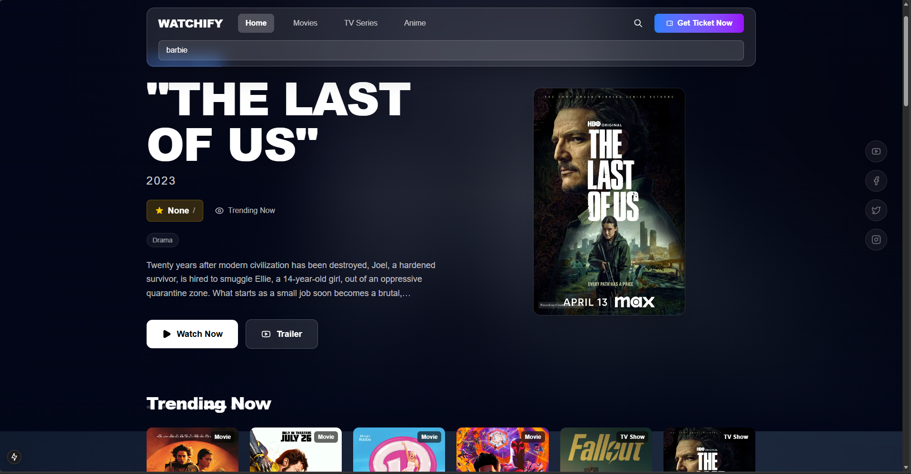

# 🎬 Watchify: Premium Recommendation Engine


Watchify is a state-of-the-art Movie, TV Show, and Anime recommendation engine. It leverages AI-powered **Content-Based Filtering** to provide personalized suggestions based on genres, plot summaries, and cast members.

---

## 📸 Interface Preview



---

## 🎥 Video Demo

Experience Watchify in action:
[**Watch Demo Video**](assets/demo.mp4)

---

## 🚀 Key Features

- **Multi-Category Support**: Seamlessly browse and get recommendations for Movies, TV Shows, and Anime.
- **AI-Powered Engine**: Uses Scikit-learn's `CountVectorizer` and `Cosine Similarity` for precise matching.
- **Micro-animations & Modern UI**: A premium, glassmorphic frontend built with Next.js and TailwindCSS.
- **Automated Data Scrapers**: High-performance scrapers for Cinematerial and Anime-Planet.
- **FastAPI Backend**: High-performance REST API for real-time recommendation processing.

---

## 🛠️ Technology Stack

| Layer | Technology |
| :--- | :--- |
| **Frontend** | [Next.js 14+](https://nextjs.org/), TypeScript, TailwindCSS, Framer Motion |
| **Backend** | [FastAPI](https://fastapi.tiangolo.com/), Python 3.x |
| **ML Engine** | Scikit-learn (Cosine Similarity, NLP) |
| **Data Processing** | Pandas, BeautifulSoup4, Requests |
| **Styling** | Vanilla CSS, Lucide React Icons |

---

## 📁 Project Structure

```bash
Movie-Recommendation-System/
├── assets/             # Project brand assets (banners, logos)
├── frontend/           # Next.js web application
├── posters/            # Cached movie/show poster images
├── scripts/            # Utility scripts & data processing samples
│   ├── data_manager.py # CSV cleanup and poster sync tool
│   ├── patch_posters.py # Fixes for broken poster links
│   └── ...
├── main.py             # FastAPI entry point (Backend)
├── recommender.py     # Core ML recommendation logic
├── scraper.py          # Main media scraper (Movies/TV)
├── anime_scraper.py    # Dedicated Anime-Planet scraper
├── movies_data.csv     # Combined dataset
└── .gitignore          # Git exclusion rules
```

---

## 🛠️ Utility Scripts
The `scripts/` directory contains tools for data maintenance:
- **Data Cleanup**: Run `python scripts/data_manager.py` to synchronize posters and prune the dataset.
- **Poster Patching**: Use `python scripts/patch_posters.py` to fix missing metadata.
- **Anime Processing**: HTML samples and processing logic for offline parsing.


### 1. Backend Setup (FastAPI)
```bash
# Install dependencies
pip install fastapi pandas scikit-learn beautifulsoup4 requests uvicorn

# Run the backend
python main.py
```
The API will be available at `http://localhost:8000`.

### 2. Frontend Setup (Next.js)
```bash
cd frontend

# Install dependencies
npm install

# Run development server
npm run dev
```
Open `http://localhost:3000` to experience Watchify.

---

## 📊 How it Works
The recommendation engine follows a structured NLP pipeline:
1. **Data Ingestion**: Scraped data is consolidated into a CSV.
2. **Feature Engineering**: Combines Name, Genres, Actors, and Plot into a "tags" corpus.
3. **Vectorization**: Transforms text into 5000-dimensional vectors using `CountVectorizer`.
4. **Similarity Calculation**: Computes the cosine of the angle between vectors to determine similarity scores ranging from 0 to 1.

---

## 🤝 Contributing
Contributions are welcome! Please feel free to submit a Pull Request.

---

## 📜 License
This project is licensed under the MIT License.
